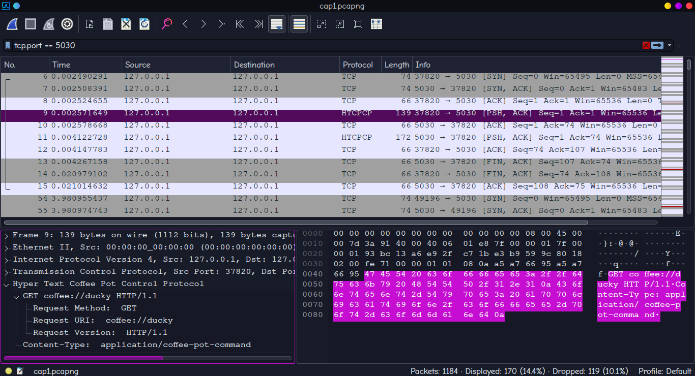
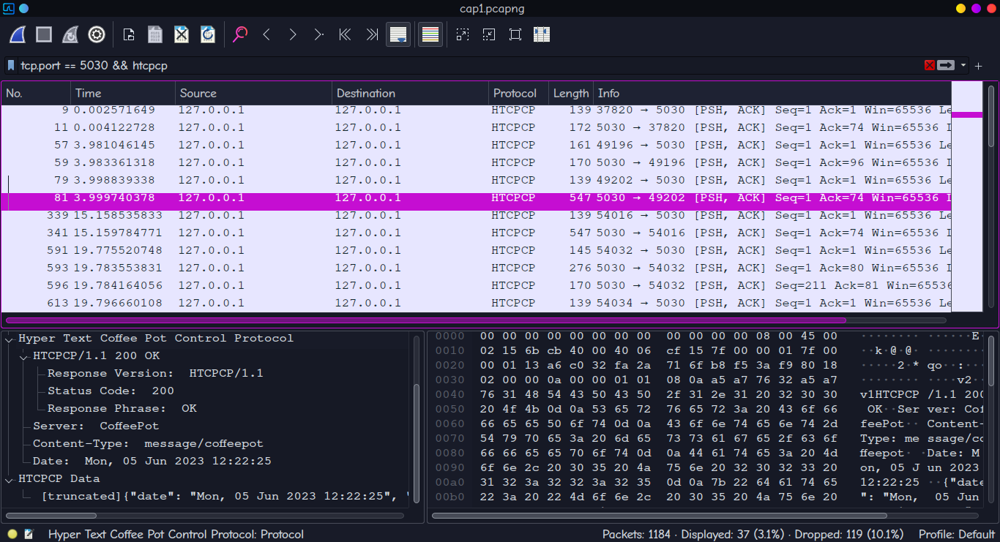

# `htcpcp_dissector`

A Wireshark dissector for HTCPCP.



## Description

In this lab, when filtering by `tcp.port==5030`, all TCP traffic will be labelled as TCP, including packets with [HTCPCP](https://www.rfc-editor.org/rfc/rfc2324) data since HTCPCP is built over TCP.
- We can't see the custom HTCPCP traffic, since Wireshark doesn't have a [dissector](https://wiki.wireshark.org/Lua/Dissectors) for it.

Installing this would label the relevant packets as HTCPCP, making your life easier when using Wireshark for this lab.
- **Note**: This disassembler does not account for [TCP packet reassembly](https://www.wireshark.org/docs/wsug_html_chunked/ChAdvReassemblySection.html) even though it is [recommended by the documentation](https://wiki.wireshark.org/Lua/Dissectors). I don't know enough about Lua to do that.

## Installation
1. Check where the *personal* plugins directory for Wireshark.
    - In Wireshark, go to `Help > About Wireshark`, and view the `Folders` tab. Your personal plugins directory would be the path referred to by `Personal Lua Plugins`.
    - Alternatively, you can check [this link](https://www.wireshark.org/docs/wsug_html_chunked/ChPluginFolders.html) for OS-specific directory locations. 
    - **Note**: For Windows, `%APPDATA%` refers to `C:\Users\[your username]\AppData\Roaming`.
    
2. Do **create** the directory if it's missing.

    ```bash
    mkdir -p [personal plugins directory]
    ```
3. Copy `htcpcp.lua` to the personal plugins directory.
    ```bash
    cp ./dissector/htcpcp.lua [personal plugins directory]
    ```
4. Re-open Wireshark, or reload the plugins with `CTRL-SHIFT-L`.


## Usage
As with any other protocol in Wireshark, you can filter by it with the tag `htcpcp`.

The plugin works for most HTCPCP traffic, including HTCPCP messages with data, though the data will be truncated if it's too large:    

